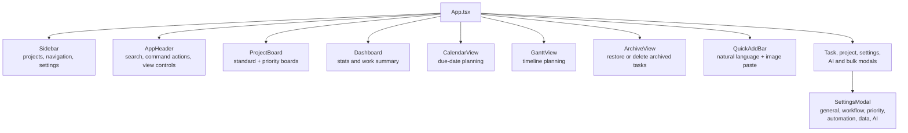
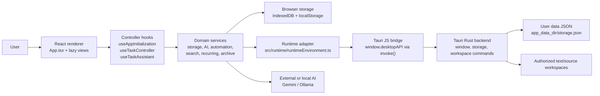
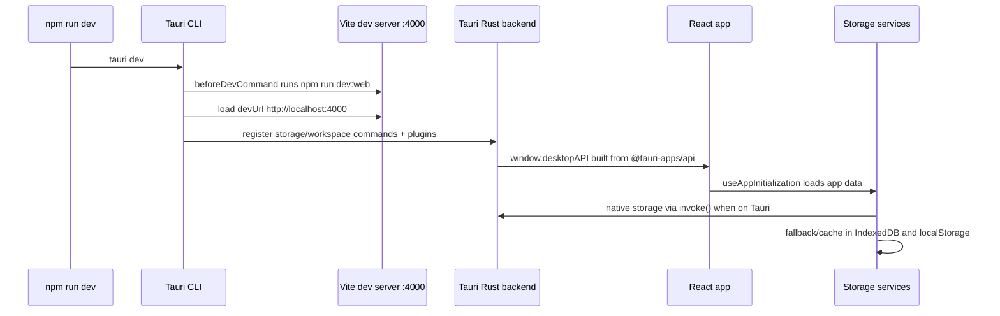
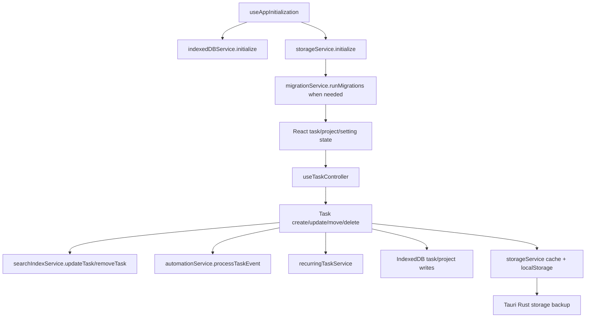
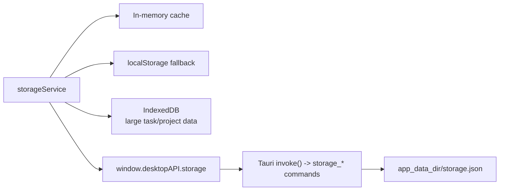

# LiquiTask

LiquiTask is a desktop-first task management app built with React 19, TypeScript,
Vite, and Tauri 2. It combines a Liquid Glass interface with Kanban workflows,
local-first persistence, automation rules, task search, recurring tasks, and
optional AI assistance through Gemini or Ollama.

## What It Includes

- **Kanban-first planning** with board, dashboard, Gantt, calendar, archive, and
  saved-view workflows.
- **Local-first data ownership** through Tauri native storage, IndexedDB, and
  localStorage fallback paths.
- **AI task orchestration** for task extraction, refinement, breakdowns,
  metadata suggestions, duplicate detection, workspace-aware assistance, and
  bulk operations.
- **Automation rules** for task events and scheduled actions such as tagging,
  priority changes, moves, field updates, and notifications.
- **Desktop integration** with custom window controls, system notifications,
  single-instance protection, and a Tauri Rust backend exposed through a narrow
  `window.desktopAPI` bridge.
- **Power-user surfaces** including command palette, keyboard shortcuts, quick
  add, search history, custom fields, templates, import/export, and archive
  recovery.

## Feature Map

| Feature area   | What the app supports                                                                                                                          |
| -------------- | ---------------------------------------------------------------------------------------------------------------------------------------------- |
| Task capture   | Modal creation, command-palette creation, quick-add parsing, image-to-task capture, bulk JSON import, AI smart import                          |
| Planning views | Standard Kanban board, priority board, dashboard, calendar, Gantt, archive, saved views, search history                                        |
| Task details   | Markdown summaries, subtasks, attachments, task links, tags, priority, due dates, time estimates, time spent, custom fields                    |
| Organization   | Projects, project types, board columns, WIP limits, priority definitions, grouping, compact mode, sub-workspace visibility                     |
| Automation     | Event rules for create/update/move/complete plus scheduled rules with filters and actions                                                      |
| AI workflows   | Task extraction, refinement, subtask generation, metadata suggestions, duplicate detection, reorganization, project assignment, image analysis |
| Productivity   | Command palette, global shortcuts, sidebar collapse, undo stack, bulk selection, bulk actions, virtualized lists                               |
| Reporting      | Dashboard stats, risk analysis, time reporting, activity log records, CSV export                                                               |
| Local data     | Native Tauri JSON storage, IndexedDB mirroring, localStorage fallback, schema migrations, archive storage                                      |
| Desktop        | Custom title bar, window controls, single-instance guard, system notifications, authorized workspace file access                              |

## App Surfaces



## Task Features

Tasks are richer than a title/status card. The active task shape includes:

- Project and board status ownership.
- Title, subtitle, summary, markdown-rendered descriptions, and activity
  history.
- Priority, tags, assignee, due date, completion timestamp, and ordering.
- Subtasks with completion state.
- Attachments, external links, and task-to-task links.
- Time estimate and time spent tracking.
- Custom field values driven by workspace definitions.
- Recurring task configuration and next-occurrence handling.
- Error logs for task-level diagnostics.

## Capture And Import

LiquiTask supports several capture paths:

- **Quick Add** parses inline markers such as `!high`, `!medium`, `!low`,
  `#project`, `+tag`, `~30m`, `~2h`, `@today`, `@tomorrow`, `@next week`, and
  `@MM/DD`.
- **Image paste** in Quick Add can analyze a screenshot or visual note and turn
  it into a task draft with title, summary, priority, estimate, and tags.
- **Command Palette** can create tasks directly from a typed query and ranks
  commands with fuzzy matching plus recent usage.
- **Manual bulk import** accepts structured task JSON and includes a downloadable
  template.
- **AI Smart Import** can map pasted CSV or JSON from tools such as Jira,
  Trello, Linear, or Asana into LiquiTask tasks.
- **Full backup restore** imports a LiquiTask JSON backup.

## Planning And Navigation

- **Kanban board** uses drag and drop through `@dnd-kit` with sortable columns
  and task cards.
- **Priority board** provides a priority-grouped planning mode.
- **Calendar view** groups tasks by due date and includes AI scheduling hooks.
- **Gantt view** renders timeline planning for dated work.
- **Dashboard** summarizes workload and progress.
- **Archive view** keeps completed or removed work recoverable.
- **Saved views** preserve useful filters and date windows.
- **Search history** keeps repeated searches fast to re-run.
- **Virtualized task lists** keep long task collections usable.

## Stack

| Area          | Technology                                                                 |
| ------------- | -------------------------------------------------------------------------- |
| Renderer      | React 19, Vite 7, TypeScript, Tailwind CSS                                 |
| Desktop shell | Tauri 2 (Rust backend, system WebView)                                     |
| Type checking | TypeScript native preview (`tsgo`) plus TypeScript 6 tooling compatibility |
| Persistence   | Tauri Rust JSON storage, IndexedDB, localStorage                          |
| AI providers  | Google Gemini, Ollama                                                      |
| Testing       | Vitest, Testing Library, jsdom, fake-indexeddb; `cargo test` (Rust)        |
| Linting       | Biome                                                                      |
| Packaging     | Tauri bundler NSIS Windows installer                                       |

## Project Diagram



## Runtime Flow



## Data And Task Flow



## Repository Layout

```text
LiquiTask/
├── App.tsx                  Main renderer app shell and lazy-loaded surfaces
├── index.tsx                React entrypoint
├── components/              Shared top-level UI components and modals
├── src/
│   ├── components/          Main feature UI: board, dashboard, AI, settings
│   ├── constants/           Storage keys, defaults, and keybindings
│   ├── context/             Keybinding provider
│   ├── contexts/            App-level React contexts
│   ├── hooks/               App initialization, task, project, AI, and UI controllers
│   ├── migrations/          Versioned local data migrations
│   ├── runtime/             Web/Tauri runtime detection and bridge helpers
│   ├── services/            Persistence, AI, automation, search, archive, export
│   ├── test/                Test setup
│   ├── types/               Shared feature types
│   └── utils/               Query, validation, search, debounce, storage helpers
├── src-tauri/               Tauri Rust backend (commands, config, capabilities)
│   ├── src/main.rs          Storage + workspace commands, plugin wiring
│   ├── tauri.conf.json      Window, bundle, and security (CSP) config
│   ├── capabilities/        ACL permissions granted to the main window
│   └── icons/               Generated app icon set
├── build/                   Source icon asset
├── dist/                    Generated Vite renderer output
├── release/                 Generated packaged installer artifacts
└── .github/                 CI, release, and release-drafter workflows
```

Generated output directories (`dist/`, `release/`, `src-tauri/target/`, and
`src-tauri/gen/`) should not be committed.

## Requirements

- Node.js 20 or newer
- npm
- Rust toolchain (stable) for the Tauri desktop backend — see <https://v2.tauri.app/start/prerequisites/>
- On Windows: the WebView2 runtime (preinstalled on Windows 11) and MSVC build tools
- Windows for the current packaged release target

## Install

```bash
npm install
```

## Run The App

Run the full desktop app:

```bash
npm run dev
```

What this does:

1. Tauri runs `beforeDevCommand` (`npm run dev:web`) to start the Vite renderer.
2. Serves the renderer on `http://localhost:4000` (`devUrl`).
3. Compiles and launches the Tauri Rust backend, loading the dev URL.
4. Exposes `window.desktopAPI` (window, storage, workspace, notifications).

Run only the web renderer:

```bash
npm run dev:web
```

Run the Vite preview server after a web build:

```bash
npm run preview
```

## Build

Build the renderer and packaged desktop app (Tauri runs `build:web` first):

```bash
npm run build
```

Build only the renderer:

```bash
npm run build:web
```

Test the Rust backend (security boundary + validation unit tests):

```bash
cd src-tauri && cargo test
```

Build outputs:

- `dist/` contains the Vite renderer bundle.
- `src-tauri/target/` contains compiled Rust artifacts.
- `src-tauri/target/release/bundle/` contains the Tauri NSIS installer.

## Code Signing And Install Warnings

When the macOS `.dmg` or Windows `.exe` is downloaded, the OS and Chrome may warn
that the app is from an unidentified developer ("LiquiTask can't be opened
because Apple cannot check it for malicious software", or Chrome's "this file
isn't commonly downloaded"). These warnings are about **code signing**, not the
app's behavior.

What the build does today (no paid certificates required):

- The macOS `.app` is **ad-hoc signed** (`signingIdentity: "-"`) with a hardened
  set of `entitlements.plist`, so it has a valid, inspectable signature and runs
  on Apple Silicon without the "damaged" error. Verify with
  `codesign -dv --verbose=4 /Applications/LiquiTask.app`.
- CI is **notarization-ready**: the signing/notarization steps activate
  automatically as soon as the secrets below are present, and fall back to
  ad-hoc otherwise.

End-user workaround until the app is notarized:

- macOS: right-click the app → **Open** (once), or run
  `xattr -dr com.apple.quarantine /Applications/LiquiTask.app`.
- Windows/Chrome: keep the download, then **Run anyway** on the SmartScreen
  prompt.

Fully removing the warnings (requires paid certificates):

- **macOS / Safari** — enroll in the Apple Developer Program ($99/yr), then set
  repository secrets `APPLE_CERTIFICATE` (base64 Developer ID Application .p12),
  `APPLE_CERTIFICATE_PASSWORD`, `APPLE_SIGNING_IDENTITY`
  (e.g. `Developer ID Application: Name (TEAMID)`), `APPLE_ID`, `APPLE_PASSWORD`
  (app-specific password), and `APPLE_TEAM_ID`. The workflow then signs with the
  Developer ID and notarizes the `.dmg`.
- **Windows / Chrome** — an Authenticode code-signing certificate (OV/EV, or
  Azure Trusted Signing) removes the SmartScreen warning; EV certificates and
  accumulated download reputation clear it fastest.

## Test And Quality

Run the full Vitest suite once:

```bash
npm run test:run
```

Run Vitest in watch mode:

```bash
npm test
```

Run coverage:

```bash
npm run test:coverage
```

Run TypeScript checks for the renderer:

```bash
npm run typecheck
```

Run Biome checks:

```bash
npm run lint
```

Apply Biome fixes:

```bash
npm run lint:fix
```

Format supported source and documentation files:

```bash
npm run format
```

## AI Configuration

AI settings are configured in **Settings > AI Settings**. Credentials and model
choices stay local.

Supported providers:

- **Gemini** uses `@google/generative-ai` and defaults to the configured Gemini
  model, with `gemini-3.1-flash-lite` as the service fallback.
- **Ollama** supports local models through the app's Ollama provider path.

AI capabilities include batch task extraction, task refinement, description
polishing, subtask generation, duplicate analysis, metadata suggestions, image
to task extraction, and conversational task assistant tool calls.

AI-specific surfaces:

- **AI Task Assistant** opens with `Cmd/Ctrl + J` and can use task-aware tool
  calls.
- **AI Insights Panel** summarizes workspace-level guidance.
- **AI Health Dashboard** checks provider configuration and operational status.
- **Bulk AI Operations** runs AI-backed changes across selected tasks.
- **AI Merge Duplicates** reviews duplicate groups and merge suggestions before
  applying them.
- **AI Reorganize** proposes task clusters and project changes with approval.
- **AI Project Assignment** suggests which project should own imported or loose
  tasks.
- **AI Subtask Suggestions** converts task summaries into actionable checklists.
- **AI Smart Import** maps external task exports into LiquiTask.

Provider behavior:

- Gemini requires a local API key and model name in settings.
- Ollama uses a local base URL and model name, with settings support for model
  pull/list/test operations where the provider exposes them.
- Workspace file access is opt-in and scoped to authorized local directories.

## Automation Rules

Automation rules are configured in **Settings > Automation** and persisted with
the rest of the local app data.

Supported triggers:

- `onCreate`
- `onUpdate`
- `onMove`
- `onComplete`
- `onSchedule`

Supported actions:

- Set a task field.
- Add or remove a tag.
- Move a task to a board column.
- Set priority.
- Send a notification.

Rules can include advanced filter conditions through the query engine. Scheduled
rules support daily, weekly, and monthly timing.

## Settings

Settings are organized by operational area:

- **General** handles app-level preferences.
- **Workflow** controls board columns, grouping, compact mode, and related task
  workflow behavior.
- **Priority** manages priority definitions, labels, colors, order, and reset.
- **Data** handles JSON export, CSV export, backup restore, manual bulk import,
  template download, AI smart import, and reset.
- **Automation** manages event and scheduled rules.
- **AI Settings** configures providers, model names, bulk operation behavior,
  workspace access, and connection testing.

## Local Persistence

LiquiTask keeps data local by design.



Important behavior:

- Tauri runtime data is backed up through `window.desktopAPI.storage`.
- Browser-compatible fallback data is stored in localStorage.
- Larger task and project collections are mirrored to IndexedDB when available.
- Data migrations run during `storageService.initialize()`.
- Workspace AI file access is limited to user-authorized directories and
  supported text/source files through Rust command guards.

## Tauri And Workspace Security

The Tauri backend enforces:

- A strict Content-Security-Policy (set in `tauri.conf.json`).
- An ACL capability allowlist (`src-tauri/capabilities/default.json`) — only the
  window, event, dialog, and notification commands the app needs are granted.
- No Node.js / direct filesystem access in the WebView; the renderer reaches
  native functionality only through registered Rust commands.

The renderer talks to the backend through `window.desktopAPI`, which wraps:

- Window controls (`@tauri-apps/api/window`).
- Window-state listeners (derived from resize events).
- Native notifications (`@tauri-apps/plugin-notification`).
- Native storage operations (`storage_*` Rust commands).
- Workspace directory selection (`@tauri-apps/plugin-dialog`).
- Authorized file reads/writes/searches (`workspace_*` Rust commands).

The `workspace_*` commands validate that file operations remain inside
user-authorized directories (with symlink-canonicalized path checks) and are
limited to an allowlist of text/source file types. These boundaries are covered
by `cargo test` unit tests in `src-tauri/src/main.rs`.

## Generated And Local State

- `dist/`, `release/`, `src-tauri/target/`, and `src-tauri/gen/` are build outputs.
- `.gitnexus/` is local generated GitNexus state.
- `.claude/skills/generated/` contains generated navigation maps for services,
  hooks, components, settings, and runtime areas.
- `node_modules/` is local dependency output.
- User app data is written under the OS app-data dir (`storage.json`).

## Keyboard Shortcuts

- `Cmd/Ctrl + K` opens the command palette.
- `Cmd/Ctrl + J` toggles the AI Task Assistant.
- `Cmd/Ctrl + E` exports data.
- `Cmd/Ctrl + B` toggles the sidebar.
- `Cmd/Ctrl + Z` undoes the last action.
- `C` creates a task.
- `Escape` closes active overlays.

## Release Flow

LiquiTask uses two GitHub Actions release paths:

1. `Release Drafter` keeps a draft release updated on pushes to `main`.
2. `Release` runs when a semantic version tag such as `v2.4.3` is pushed.

The tagged release workflow:

1. Installs dependencies with `npm ci`.
2. Runs the full test suite.
3. Verifies that the git tag matches `package.json`.
4. Builds the Tauri package with the platform Rust toolchain.
5. Uploads the packaged installer artifacts to the GitHub Release.

Current package version: `2.4.3`.

Expected release assets:

- `LiquiTask-Setup-2.4.3.exe`
- `LiquiTask-2.4.3-arm64.dmg`
- `LiquiTask-2.4.3-x64.dmg`

Create a release:

```bash
git tag v2.4.3
git push origin v2.4.3
```

Before tagging a new version, update:

- `package.json`
- `package-lock.json`

Patch notes are generated by Release Drafter using:

- `.github/workflows/release-drafter.yml`
- `.github/release-drafter.yml`
- `.github/workflows/release.yml`

## Development Notes

- Vite is configured in `vite.config.ts` with `server.port = 4000`,
  `strictPort = true` (Tauri loads a fixed `devUrl`), and `host = "0.0.0.0"`.
- The renderer uses `base: "./"` so the packaged app loads local assets
  correctly.
- The window is created `decorations: false` + `visible: false`; the custom
  title bar uses `data-tauri-drag-region`, and the renderer reveals the window
  after mount via `showRuntimeWindow()`.
- The Tauri bridge (`src/runtime/runtimeEnvironment.ts`) exposes only window
  controls, notifications, storage, and authorized workspace file operations.
- GitNexus maps live in `.claude/skills/generated/` and are useful before
  making high-risk changes to services, hooks, settings, or runtime code.

## License

MIT
