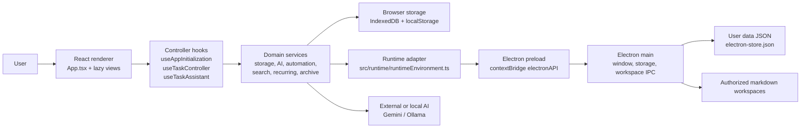
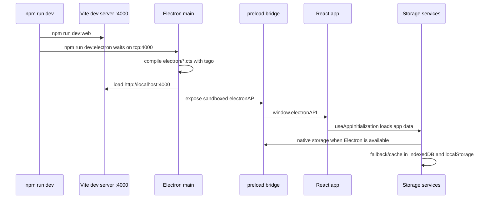
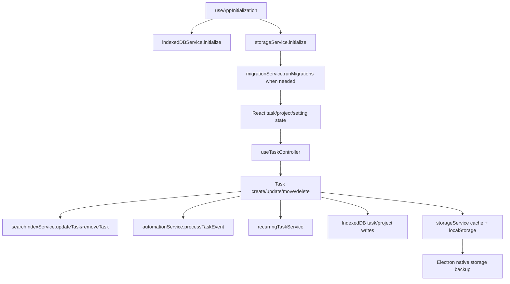
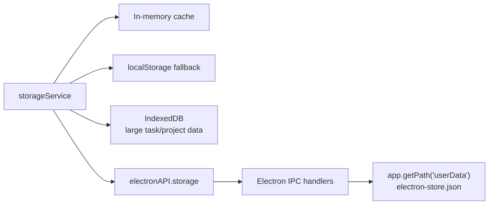

# LiquiTask

LiquiTask is a desktop-first task management app built with React 19, TypeScript,
Vite, and Electron. It combines a Liquid Glass interface with Kanban workflows,
local-first persistence, automation rules, task search, recurring tasks, and
optional AI assistance through Gemini or Ollama.

## What It Includes

- **Kanban-first planning** with board, dashboard, Gantt, calendar, archive, and
  saved-view workflows.
- **Local-first data ownership** through Electron native storage, IndexedDB, and
  localStorage fallback paths.
- **AI task orchestration** for task extraction, refinement, breakdowns,
  metadata suggestions, duplicate detection, workspace-aware assistance, and
  bulk operations.
- **Automation rules** for task events and scheduled actions such as tagging,
  priority changes, moves, field updates, and notifications.
- **Desktop integration** with custom window controls, system notifications,
  single-instance protection, and a sandboxed Electron preload bridge.
- **Power-user surfaces** including command palette, keyboard shortcuts, quick
  add, search history, custom fields, templates, import/export, and archive
  recovery.

## Stack

| Area          | Technology                                                                 |
| ------------- | -------------------------------------------------------------------------- |
| Renderer      | React 19, Vite 7, TypeScript, Tailwind CSS                                 |
| Desktop shell | Electron 39 main/preload processes                                         |
| Type checking | TypeScript native preview (`tsgo`) plus TypeScript 6 tooling compatibility |
| Persistence   | Electron JSON storage, IndexedDB, localStorage                             |
| AI providers  | Google Gemini, Ollama                                                      |
| Testing       | Vitest, Testing Library, jsdom, fake-indexeddb                             |
| Linting       | Biome                                                                      |
| Packaging     | electron-builder NSIS Windows installer                                    |

## Project Diagram



## Runtime Flow



## Data And Task Flow



## Repository Layout

```text
LiquiTask/
├── App.tsx                  Main renderer app shell and lazy-loaded surfaces
├── index.tsx                React entrypoint
├── components/              Shared top-level UI components and modals
├── src/
│   ├── components/          Main feature UI: board, dashboard, AI, settings
│   ├── constants/           Storage keys, defaults, and keybindings
│   ├── context/             Keybinding provider
│   ├── contexts/            App-level React contexts
│   ├── hooks/               App initialization, task, project, AI, and UI controllers
│   ├── migrations/          Versioned local data migrations
│   ├── runtime/             Web/Electron runtime detection and bridge helpers
│   ├── services/            Persistence, AI, automation, search, archive, export
│   ├── test/                Test setup
│   ├── types/               Shared feature types
│   └── utils/               Query, validation, search, debounce, storage helpers
├── electron/                Electron main/preload TypeScript sources
├── build/                   Icons and packaging assets
├── dist/                    Generated Vite renderer output
├── dist-electron/           Generated Electron main/preload output
├── release/                 Generated packaged installer artifacts
└── .github/                 CI, release, and release-drafter workflows
```

Generated output directories (`dist/`, `dist-electron/`, `release/`) should not
be committed.

## Requirements

- Node.js 20 or newer
- npm
- Bun 1.3 or newer for Electron desktop development and packaging support
- Windows for the current packaged release target

## Install

```bash
npm install
```

## Run The App

Run the full desktop app:

```bash
npm run dev
```

What this does:

1. Starts the Vite renderer with `npm run dev:web`.
2. Serves the renderer on `http://localhost:4000`.
3. Waits for port `4000`.
4. Compiles Electron main/preload code with `tsgo -p electron/tsconfig.json`.
5. Launches Electron in development mode.

Run only the web renderer:

```bash
npm run dev:web
```

Run the Vite preview server after a web build:

```bash
npm run preview
```

## Build

Build the renderer, Electron code, and packaged desktop app:

```bash
npm run build
```

Build only the renderer:

```bash
npm run build:web
```

Build only the Electron main/preload output:

```bash
npm run build:electron
```

Build outputs:

- `dist/` contains the Vite renderer bundle.
- `dist-electron/` contains compiled Electron main/preload files.
- `release/` contains electron-builder installer artifacts.

## Test And Quality

Run the full Vitest suite once:

```bash
npm run test:run
```

Run Vitest in watch mode:

```bash
npm test
```

Run coverage:

```bash
npm run test:coverage
```

Run TypeScript checks for renderer and Electron code:

```bash
npm run typecheck
```

Run Biome checks:

```bash
npm run lint
```

Apply Biome fixes:

```bash
npm run lint:fix
```

Format supported source and documentation files:

```bash
npm run format
```

## AI Configuration

AI settings are configured in **Settings > AI Settings**. Credentials and model
choices stay local.

Supported providers:

- **Gemini** uses `@google/generative-ai` and defaults to the configured Gemini
  model, with `gemini-3.1-flash-lite` as the service fallback.
- **Ollama** supports local models through the app's Ollama provider path.

AI capabilities include batch task extraction, task refinement, description
polishing, subtask generation, duplicate analysis, metadata suggestions, image
to task extraction, and conversational task assistant tool calls.

## Local Persistence

LiquiTask keeps data local by design.



Important behavior:

- Electron runtime data is backed up through `electronAPI.storage`.
- Browser-compatible fallback data is stored in localStorage.
- Larger task and project collections are mirrored to IndexedDB when available.
- Data migrations run during `storageService.initialize()`.
- Workspace AI file access is limited to user-authorized directories and
  markdown files through Electron IPC guards.

## Keyboard Shortcuts

- `Cmd/Ctrl + K` opens the command palette.
- `Cmd/Ctrl + J` toggles the AI Task Assistant.
- `Cmd/Ctrl + E` exports data.
- `Cmd/Ctrl + B` toggles the sidebar.
- `Cmd/Ctrl + Z` undoes the last action.
- `C` creates a task.
- `Escape` closes active overlays.

## Release Flow

LiquiTask uses two GitHub Actions release paths:

1. `Release Drafter` keeps a draft release updated on pushes to `main`.
2. `Release` runs when a semantic version tag such as `v2.4.1` is pushed.

The tagged release workflow:

1. Installs dependencies with `npm ci`.
2. Runs the full test suite.
3. Verifies that the git tag matches `package.json`.
4. Builds the Electron package.
5. Uploads packaged Windows artifacts to the GitHub Release.

Current package version: `2.4.1`.

Expected Windows release assets:

- `LiquiTask-Setup-2.4.1.exe`
- `LiquiTask-Setup-2.4.1.exe.blockmap`

Create a release:

```bash
git tag v2.4.1
git push origin v2.4.1
```

Before tagging a new version, update:

- `package.json`
- `package-lock.json`

Patch notes are generated by Release Drafter using:

- `.github/workflows/release-drafter.yml`
- `.github/release-drafter.yml`
- `.github/workflows/release.yml`

## Development Notes

- Vite is configured in `vite.config.ts` with `server.port = 4000` and
  `host = "0.0.0.0"`.
- The renderer uses `base: "./"` so packaged Electron loads local assets
  correctly.
- Electron runs with `sandbox: true`, `contextIsolation: true`, and
  `nodeIntegration: false`.
- The preload bridge exposes only window controls, notifications, storage, and
  authorized workspace file operations.
- GitNexus maps live in `.claude/skills/generated/` and are useful before
  making high-risk changes to services, hooks, settings, Electron, or runtime
  code.

## License

MIT
