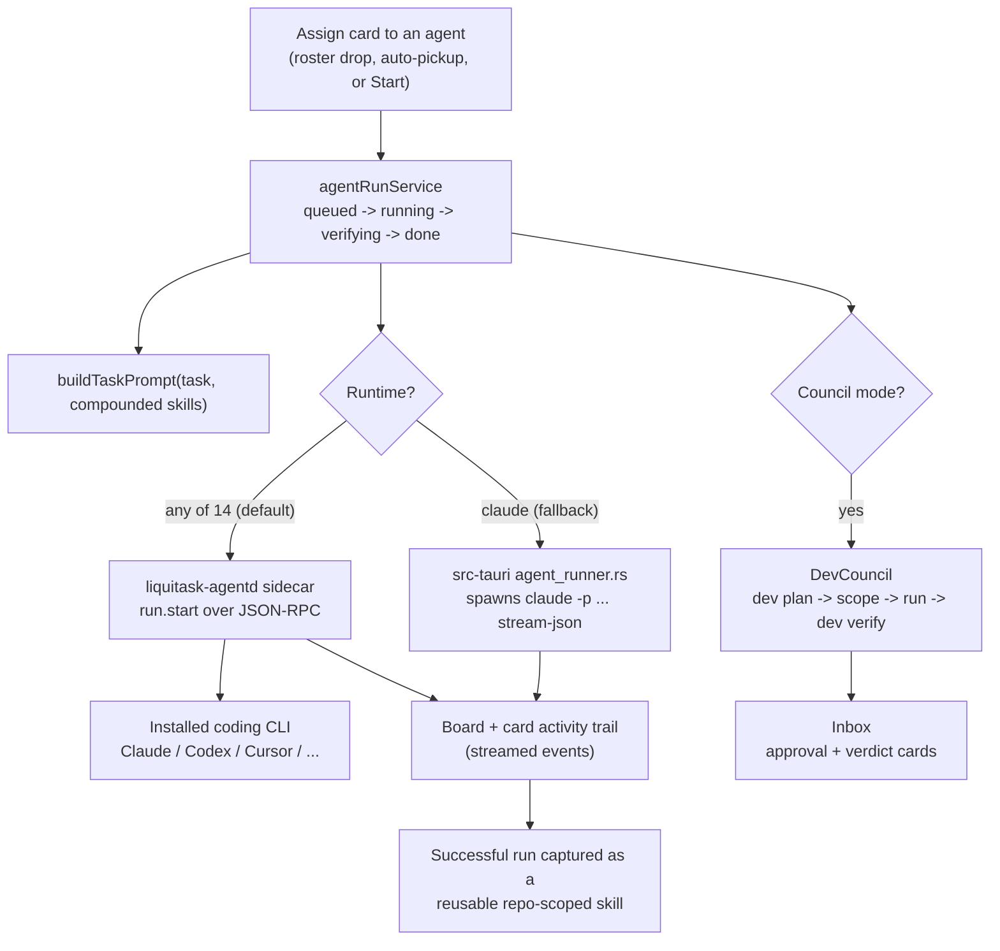
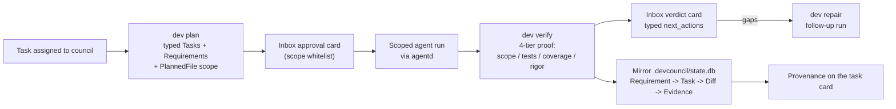
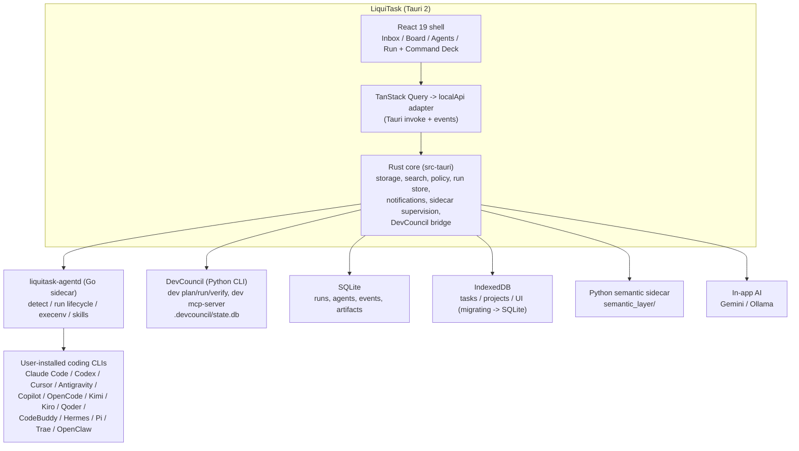
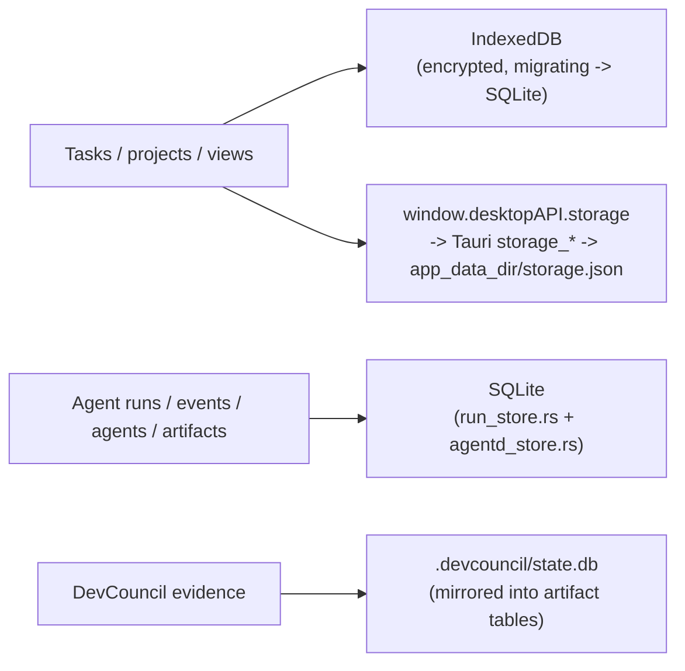

# LiquiTask

LiquiTask is a **local-first agentic task workbench**: a desktop app where every
task on the board can be handed to a coding agent the way you'd hand it to a
teammate. Assign a card to Claude Code, Codex, Cursor, Antigravity, or any of
**14 supported agent runtimes**; the run streams into the card's activity trail,
the card moves across the board as the work progresses, and — when you want proof
instead of a claim — the whole run is gated by **DevCouncil**: plan, scope
enforcement, and a deterministic verification loop.

Built with React 19, TypeScript, Tauri 2 (Rust), a Go agent sidecar
(`liquitask-agentd`), and a local liquid-glass UI, LiquiTask keeps your work
graph, agent runs, and evidence entirely on your machine.

> **Direction note.** LiquiTask began as a Kanban task manager with optional
> AI assistance and is being reworked into the agent workbench described here
> (see [`docs/REWORK_PLAN_MULTICA.md`](docs/REWORK_PLAN_MULTICA.md)). The task
> board, local-first persistence, automation, search, and AI task features are
> shipped and stable. The multi-agent execution layer (`liquitask-agentd`),
> DevCouncil gates, and the four-surface v3 shell are built and enabled by
> default, with pieces still maturing — those are flagged explicitly below so
> you always know what's solid versus in progress.

## What It Is

- **An agent workbench.** Tasks are executable. Assign any card to a human, a
  coding agent, or a DevCouncil-gated run. Assignment creates a tracked run with
  scope, streaming output, and approval gates — not a fire-and-forget prompt.
- **Multi-agent, local, BYO-CLI.** LiquiTask drives the coding CLIs you already
  have installed through the `liquitask-agentd` sidecar. Nothing runs in the
  cloud; your API keys and repos stay local.
- **Gated by evidence, not confidence.** DevCouncil turns "the agent said it's
  done" into "the change was scoped, tested, and proven," with an
  auditable Requirement → Task → Diff → Evidence graph on the card.
- **Still a great task manager.** Kanban board, calendar, Gantt, dashboard,
  archive, automation rules, sub-5ms search, recurring tasks, custom fields, and
  local AI task assistance all remain first-class.

## Maturity At A Glance

| Area | State |
| ---- | ----- |
| Kanban board, views, search, automation, recurring tasks, custom fields | **Shipped / stable** |
| Local-first persistence (IndexedDB + Tauri native storage, encryption at rest) | **Shipped / stable** |
| AI task features (extraction, refinement, subtasks, dedupe, image-to-task) via Gemini / Ollama | **Shipped / stable** |
| Agent teammates — assign a card to an agent, streamed run, board lifecycle | **Shipped** |
| `liquitask-agentd` Go sidecar + all 14 runtime backends | **Built** (`AGENTD_SIDECAR_ENABLED: true`); Rust `agent_runner.rs` retained as the Claude fallback during migration |
| DevCouncil bridge — plan, scope enforcement, verify gate, evidence-graph mirror, MCP registration | **Built**, deepening |
| Four-surface shell (Inbox / Board / Agents / Run) + Command Deck | **Enabled** (`V3_SHELL_ENABLED: true`); surfaces still being ported/reskinned |
| Task / project storage on SQLite | **In progress** — schema groundwork landed; tasks/projects still read/write IndexedDB today |

Feature flags live in `src/constants/index.ts`:

```ts
export const FEATURE_FLAGS = {
  AI_ASSISTANT_SIDEBAR_ENABLED: false, // legacy AI sidebar, superseded by the Run surface
  AGENTD_SIDECAR_ENABLED: true,        // route non-Claude agent runs through liquitask-agentd
  V3_SHELL_ENABLED: true,              // four-surface shell: Inbox / Board / Agents / Run
} as const;
```

## Supported Agent Runtimes

Agent execution is handled by `liquitask-agentd`, a Go sidecar ported from
Multica's battle-tested `pkg/agent` (14 backends, each with its own test suite
and per-OS invocation handling). Drive whichever CLIs you have installed and
authenticated:

| | | | |
| --- | --- | --- | --- |
| Claude Code | Codex | Cursor | Antigravity |
| GitHub Copilot | OpenCode | Kimi | Kiro |
| Qoder | CodeBuddy | Hermes (ACP) | Pi |
| Trae | OpenClaw | | |

`Settings → Agents` shows live detection (installed / version) for each runtime,
plus DevCouncil (`dev`) and container-sandbox availability.

## How An Agent Run Works


```mermaid
flowchart TD
  Assign["Assign card to an agent\n(roster drop, auto-pickup, or Start)"] --> Run["agentRunService\nqueued -> running -> verifying -> done"]
  Run --> Prompt["buildTaskPrompt(task, compounded skills)"]
  Run --> Route{Runtime?}
  Route -->|"claude (fallback)"| Rust["src-tauri agent_runner.rs\nspawns claude -p ... stream-json"]
  Route -->|"any of 14 (default)"| Agentd["liquitask-agentd sidecar\nrun.start over JSON-RPC"]
  Agentd --> CLI["Installed coding CLI\nClaude / Codex / Cursor / ..."]
  Run --> Council{"Council mode?"}
  Council -->|yes| DevCouncil["DevCouncil\ndev plan -> scope -> run -> dev verify"]
  Rust --> Board["Board + card activity trail\n(streamed events)"]
  Agentd --> Board
  DevCouncil --> Inbox["Inbox\napproval + verdict cards"]
  Board --> Skill["Successful run captured as a\nreusable repo-scoped skill"]
```

- **Assignment** — an agent profile's *name* is its assignee label; assigning a
  task to that name routes it to the agent. Assign by dropping a card on an
  agent chip in the roster tray, via per-agent auto-pickup, or the Start button
  in the Agent Runs dock.
- **Working directory** — must be an authorised workspace folder (the same
  security boundary as workspace file access).
- **Lifecycle on the board** — start moves the card to In Progress and posts an
  activity entry; completion posts the agent's summary; failures land in the
  card's error logs. One run per agent at a time; further assignments queue.
- **Skills compounding** — every successful run is captured as a reusable,
  repo-scoped skill and injected into future prompts as "Team knowledge," so
  agents get better at your codebase over time.
- **Durable / headless runs** — runs are spawned detached (own process group on
  unix, `DETACHED_PROCESS` on Windows) with output redirected to an on-disk
  event log, so a run keeps working with the window closed and the UI reattaches
  on relaunch. See [`docs/AGENT_TEAMMATES.md`](docs/AGENT_TEAMMATES.md) for the
  full lifecycle, reattach/reconcile model, and terminal-handoff escape hatch.

### The `liquitask-agentd` sidecar

`liquitask-agentd` is a standalone Go binary shipped as a Tauri sidecar. It
speaks newline-delimited JSON-RPC over stdio to the Rust core and owns CLI
detection, the 14 `Backend` implementations, per-run execution-environment
preparation (`execenv`), run lifecycle + reconcile, and local skill discovery —
with the cloud coupling (auth, WebSockets, billing, workspace registration)
stripped out of the ported Multica code.

JSON-RPC surface (v1), consumed by `src-tauri/src/agentd.rs`:

| Method | Purpose |
| ------ | ------- |
| `detect` | Installed runtimes + versions (drives `Settings → Agents` health) |
| `run.start` | Start a run: `{ taskId, runtime, model, cwd, prompt, scope?, mcpConfig?, thinkingLevel?, resumeSessionId? }` |
| `run.events` | Stream: `message \| tool_use \| thinking \| permission_request \| result \| error` |
| `run.cancel` / `run.pause` / `run.resume` / `run.inject` | Run control + mid-run guidance injection |
| `run.reattach` | Re-adopt orphaned runs after an app restart |
| `permission.respond` | Answer a permission request (`allow` / `deny` / `always`) |
| `skills.list` | Installed-skill discovery for prompt compounding |

## DevCouncil Integration

[DevCouncil](https://github.com/bharathvbcr/DevCouncil) is a gated AI
orchestrator: it makes AI-generated work *prove* it satisfied the original
intent. LiquiTask embeds DevCouncil as an opt-in gate around agent runs through
the Rust bridge in `src-tauri/src/agent_devcouncil.rs` and
`agent_devcouncil_evidence.rs`.


```mermaid
flowchart LR
  Task["Task assigned to council"] --> Plan["dev plan\ntyped Tasks + Requirements\n+ PlannedFile scope"]
  Plan --> Approve["Inbox approval card\n(scope whitelist)"]
  Approve --> Exec["Scoped agent run\nvia agentd"]
  Exec --> Verify["dev verify\n4-tier proof:\nscope / tests / coverage / rigor"]
  Verify --> Verdict["Inbox verdict card\ntyped next_actions"]
  Verdict -->|gaps| Repair["dev repair\nfollow-up run"]
  Verify --> Evidence["Mirror .devcouncil/state.db\nRequirement -> Task -> Diff -> Evidence"]
  Evidence --> Card["Provenance on the task card"]
```

What the bridge does:

- **Plan gate** — "Assign to council" runs `dev plan` and renders the typed
  Tasks/Requirements plus a `PlannedFile` scope whitelist as an Inbox approval
  card. Approving spawns agent runs bound to that scope
  (`run_dev_plan` / `agent_dev_plan`).
- **Scope enforcement** — the whitelist is passed into `run.start`; agents get
  it via their permission mechanism (MCP permission server for Claude Code,
  config injection for others), and the Rust policy layer (`agent_policy.rs`)
  blocks out-of-scope writes as a second gate.
- **Verify gate** — run completion triggers `dev verify` (scope compliance,
  tests, coverage, rigor). The verdict card carries typed `next_actions`;
  "Repair" spawns a follow-up run seeded with the structured repair
  instructions (`run_dev_verify`, `run_dev_repair`). Done means proven, not
  agent-claims-done.
- **Evidence graph** — `mirror_evidence_graph` polls `.devcouncil/state.db` and
  mirrors the Requirement → Task → Diff → Evidence links into LiquiTask's
  artifact tables so provenance renders on the card.
- **MCP** — `dev mcp-server` is registered in the MCP config `agentd` passes to
  runs, so agents can self-serve checkout → verify → repair loops.

The DevCouncil path shells out to the `dev` CLI; `agent_dev_cli_available()`
detects it. Enable the full council pipeline in a target repo with
`dev integrate claude --apply` so Claude Code picks up DevCouncil's MCP tools
and hook policies during runs.

## The Four Surfaces (v3 shell)

With `V3_SHELL_ENABLED` (on by default), the nine-view switcher is replaced by
four surfaces; classic board views (Calendar, Gantt, Archive, List) become
lenses inside **Board**.

- **Inbox (default).** A triage feed: approvals awaiting you, runs finished,
  council verdicts, blocked agents, standup digests. Each card has inline
  actions (approve/deny, open run, re-run, snooze) and drives the tray badge.
- **Board.** The existing Kanban board, decluttered: task cards gain agent chips
  (assignee avatar, presence ring, live run status). Drag a card onto an agent
  in the roster tray to assign + run.
- **Agents.** Roster with presence, per-agent runtime profile (detected CLI +
  model + thinking level), skills, allowlists, run history, and usage.
- **Run (drawer / full-screen).** Streamed transcript, tool-call timeline, diff
  viewer, inline permission prompts, a guidance-injection box, and an
  open-in-terminal escape hatch.

**Command Deck** — the command palette (`⌘/Ctrl + K`) is the universal
keyboard entry point: create a task, assign to an agent or council, jump to a
run, toggle surfaces, run an autopilot.

## Task Features

Tasks are richer than a title/status card. The active task shape includes:

- Project and board status ownership.
- Title, subtitle, summary, markdown-rendered descriptions, and activity
  history (including streamed agent-run events).
- Priority, tags, assignee (human **or** agent), due date, completion
  timestamp, and ordering.
- Subtasks with completion state.
- Attachments, external links, and task-to-task links.
- Time estimate and time spent tracking (fed by verified agent-run outcomes).
- Custom field values driven by workspace definitions.
- Recurring task configuration and next-occurrence handling.
- Agent assignment, run history, DevCouncil evidence/provenance, and error logs.

## Capture And Import

- **Quick Add** parses inline markers such as `!high`, `!medium`, `!low`,
  `#project`, `+tag`, `~30m`, `~2h`, `@today`, `@tomorrow`, `@next week`, and
  `@MM/DD`.
- **Image paste** in Quick Add analyzes a screenshot or visual note into a task
  draft (title, summary, priority, estimate, tags).
- **Command Deck** creates tasks directly from a typed query with fuzzy ranking.
- **Manual bulk import** accepts structured task JSON with a downloadable
  template.
- **AI Smart Import** maps pasted CSV/JSON from Jira, Trello, Linear, or Asana
  into LiquiTask tasks.
- **Full backup restore** imports a LiquiTask JSON backup.

## Stack

| Area | Technology |
| ---- | ---------- |
| Renderer | React 19, Vite 7, TypeScript, Tailwind CSS (liquid-glass design system) |
| Desktop shell | Tauri 2 (Rust backend, system WebView) |
| Agent execution | `liquitask-agentd` Go sidecar (14 runtime backends, JSON-RPC over stdio) |
| Gating / verification | DevCouncil (`dev` CLI) via the Rust bridge |
| Deterministic core | `crates/liquitask-core` Rust library (date math, scoring, aggregation) — see [`docs/RUST_MIGRATION.md`](docs/RUST_MIGRATION.md) |
| Semantic search | Python semantic sidecar (`semantic_layer/`) |
| Type checking | TypeScript native preview (`tsgo`) + TypeScript 6 tooling |
| Persistence | SQLite (runs, events, agents, artifacts), IndexedDB (tasks/projects — migrating to SQLite), Tauri native JSON storage, localStorage fallback |
| In-app AI | Google Gemini, Ollama |
| Testing | Vitest, Testing Library, jsdom, fake-indexeddb; `cargo test` (Rust); `go test` (agentd) |
| Linting | Biome |
| Packaging | Tauri bundler (macOS `.dmg`, Windows NSIS installer), sidecars bundled |

## Architecture


```mermaid
flowchart TD
  subgraph LiquiTask["LiquiTask (Tauri 2)"]
    UI["React 19 shell\nInbox / Board / Agents / Run + Command Deck"]
    UI --> Query["TanStack Query -> localApi adapter\n(Tauri invoke + events)"]
    Query --> Core["Rust core (src-tauri)\nstorage, search, policy, run store,\nnotifications, sidecar supervision,\nDevCouncil bridge"]
  end
  Core --> Agentd["liquitask-agentd (Go sidecar)\ndetect / run lifecycle / execenv / skills"]
  Core --> DevCouncil["DevCouncil (Python CLI)\ndev plan/run/verify, dev mcp-server\n.devcouncil/state.db"]
  Core --> SQLite["SQLite\nruns, agents, events, artifacts"]
  Core --> IDB["IndexedDB\ntasks / projects / UI (migrating -> SQLite)"]
  Core --> Semantic["Python semantic sidecar\nsemantic_layer/"]
  Agentd --> CLIs["User-installed coding CLIs\nClaude Code / Codex / Cursor / Antigravity /\nCopilot / OpenCode / Kimi / Kiro / Qoder /\nCodeBuddy / Hermes / Pi / Trae / OpenClaw"]
  Core --> AI["In-app AI\nGemini / Ollama"]
```

## Repository Layout

```text
LiquiTask/
├── App.tsx                  Main renderer shell (legacy tree + v3 four-surface shell)
├── index.tsx                React entrypoint
├── components/              Legacy top-level UI wrappers (being folded into src/)
├── src/
│   ├── components/          Feature UI: board, dashboard, agents/, AI, settings
│   │   └── agents/          Agent roster, runs dock, drop tray, standup card
│   ├── constants/           Storage keys, defaults, keybindings, FEATURE_FLAGS
│   ├── hooks/               App init, task/project controllers, useAgentTeammates
│   ├── migrations/          Versioned local data migrations
│   ├── runtime/             Web/Tauri runtime detection + callNative bridge
│   ├── services/            Persistence, AI, automation, search, archive, export
│   │   └── agents/          agentRunService, agentd wiring, DevCouncil planner,
│   │                        policy, scope, skills, campaign orchestration
│   ├── ui/ · core/ · views/ v3 shell layers (primitives · domain · screens)
│   └── utils/               Query, validation, search, storage helpers
├── src-tauri/               Tauri Rust backend
│   ├── src/agentd.rs        JSON-RPC bridge to liquitask-agentd
│   ├── src/agent_*.rs       Runner (Claude fallback), policy, skills, git, MCP
│   ├── src/agent_devcouncil*.rs  DevCouncil plan/verify/repair + evidence mirror
│   ├── src/logic/           Thin Tauri wrappers over liquitask-core
│   ├── tauri.conf.json      Window, bundle, CSP, sidecar config
│   └── capabilities/        ACL permission allowlist
├── liquitask-agentd/        Go agent sidecar (14 backends, execenv, daemon, rpc)
├── crates/liquitask-core/   Pure Rust deterministic core library
├── semantic_layer/          Python semantic-search sidecar
├── scripts/                 Sidecar build + verification scripts
├── vendor/multica-ref/      Read-only Multica reference snapshot (excluded from build)
└── docs/                    Rework plan, agent teammates, migration, signing
```

Generated output directories (`dist/`, `release/`, `src-tauri/target/`,
`src-tauri/gen/`) and local state (`.gitnexus/`, `.devcouncil/`,
`.claude/skills/generated/`) should not be committed.

## Requirements

- Node.js 20 or newer, and npm.
- Rust toolchain (stable) for the Tauri desktop backend and `liquitask-core` —
  see <https://v2.tauri.app/start/prerequisites/>.
- Go (1.22+) to build the `liquitask-agentd` sidecar (`npm run build:agentd`).
- Python 3 to build the semantic-search sidecar.
- On Windows: the WebView2 runtime (preinstalled on Windows 11) and MSVC build
  tools.

To *use* agents at runtime you additionally need the relevant CLIs on `PATH`:

- One or more coding-agent CLIs (`claude`, `codex`, `cursor-agent`, etc.),
  installed and authenticated.
- The DevCouncil `dev` CLI (from the DevCouncil repo, via `uv`) for council
  planning and verify gates.
- Optional: `container` (macOS 26+, Apple silicon) for the sandbox run mode.

`Settings → Agents` shows live detection for all three.

## Install

```bash
npm install
```

## Run The App

Run the full desktop app (builds the agentd sidecar + a semantic-sidecar stub,
then launches Tauri):

```bash
npm run dev
```

What this does:

1. Prepares the semantic-sidecar stub and builds `liquitask-agentd`.
2. Tauri runs `beforeDevCommand` (`npm run dev:web`) to start the Vite renderer
   on `http://localhost:4000` (`devUrl`).
3. Compiles and launches the Tauri Rust backend, loading the dev URL and
   supervising the sidecars.
4. Exposes `window.desktopAPI` (window, storage, workspace, notifications) and
   the agentd / DevCouncil bridges.

Run only the web renderer (no desktop backend, no agents):

```bash
npm run dev:web
```

## Build

Build the renderer, sidecars, and packaged desktop app:

```bash
npm run build          # build:semantic-sidecar + build:agentd + tauri build
npm run build:mac      # same, targeting aarch64-apple-darwin
```

Build only a piece:

```bash
npm run build:web              # renderer only
npm run build:agentd           # liquitask-agentd Go sidecar
npm run build:semantic-sidecar # Python semantic sidecar
```

Build outputs:

- `dist/` — Vite renderer bundle.
- `src-tauri/target/` — compiled Rust artifacts.
- `src-tauri/target/release/bundle/` — Tauri installers (`.dmg` / NSIS `.exe`).

## Test And Quality

```bash
npm run test:run       # full Vitest suite once
npm test               # Vitest watch mode
npm run test:coverage  # coverage
npm run typecheck      # tsgo renderer type check
npm run lint           # Biome
npm run lint:fix       # Biome autofix
npm run format         # Prettier

cd src-tauri && cargo test                 # Rust backend (security + validation)
cargo test --manifest-path crates/liquitask-core/Cargo.toml   # pure core crate
cd liquitask-agentd && go test ./...       # Go agent sidecar (per-backend suites)
```

## AI Configuration

In-app AI (the task-authoring features — extraction, refinement, subtasks,
dedupe, image-to-task, smart import) is configured in **Settings → AI Settings**;
credentials and model choices stay local.

- **Gemini** uses `@google/generative-ai` with `gemini-3.1-flash-lite` as the
  service fallback.
- **Ollama** runs local models via the app's Ollama provider path.

This is distinct from **agent runtimes** (Claude Code, Codex, …), which are
external CLIs driven through `liquitask-agentd` and configured in
**Settings → Agents**.

AI-specific surfaces include the AI Task Assistant (`Cmd/Ctrl + J`), AI Insights
Panel, AI Health Dashboard, Bulk AI Operations, AI Merge Duplicates, AI
Reorganize, AI Project Assignment, AI Subtask Suggestions, and AI Smart Import.

## Automation Rules

Configured in **Settings → Automation** and persisted with the rest of the local
app data.

Triggers: `onCreate`, `onUpdate`, `onMove`, `onComplete`, `onSchedule`.
Actions: set a field, add/remove a tag, move to a column, set priority, send a
notification (and, increasingly, assign to an agent). Rules support advanced
filter conditions via the query engine; scheduled rules support daily, weekly,
and monthly timing.

## Local Persistence

LiquiTask keeps data local by design.


```mermaid
flowchart LR
  Tasks["Tasks / projects / views"] --> IDB["IndexedDB\n(encrypted, migrating -> SQLite)"]
  Tasks --> Native["window.desktopAPI.storage\n-> Tauri storage_* -> app_data_dir/storage.json"]
  Runs["Agent runs / events / agents / artifacts"] --> SQLite["SQLite\n(run_store.rs + agentd_store.rs)"]
  Evidence["DevCouncil evidence"] --> DCDB[".devcouncil/state.db\n(mirrored into artifact tables)"]
```

Important behavior:

- Task/project data is encrypted at rest, cached in memory, mirrored to
  IndexedDB, and backed up through Tauri native storage. A migration to SQLite
  (so the whole work graph is queryable by agents through one store) is in
  progress — schema groundwork has landed.
- Agent runs, events, agent records, and artifacts live in SQLite so the sidecar
  and the reattach/reconcile paths share durable server-side state.
- Data migrations run during `storageService.initialize()`.
- Workspace file access (for both AI and agents) is limited to user-authorized
  directories and supported text/source files, enforced by Rust command guards.

## Tauri, Agent, And Workspace Security

- A strict Content-Security-Policy (`tauri.conf.json`) and an ACL capability
  allowlist (`src-tauri/capabilities/default.json`) — only the commands the app
  needs are granted. No Node.js / direct filesystem access in the WebView.
- **Agent runs never pass a raw command line.** The Rust runner assembles argv
  from structured, validated parameters (modes: `claude`, `claude-container`,
  `devcouncil-verify`, `devcouncil-e2e`, and agentd-routed runtimes). Working
  directories are validated against the workspace allowlist; flag-shaped values
  are rejected; every process is tracked and cancellable.
- **DevCouncil scope acts as a second gate**: out-of-scope writes are blocked by
  `agent_policy.rs` even if an agent attempts them.
- The `workspace_*` commands validate that file operations remain inside
  user-authorized directories (symlink-canonicalized) and are limited to an
  allowlist of text/source file types. These boundaries are covered by
  `cargo test` in `src-tauri/src/main.rs`.

## Keyboard Shortcuts

- `Cmd/Ctrl + K` opens the Command Deck (command palette).
- `Cmd/Ctrl + J` toggles the AI Task Assistant.
- `Cmd/Ctrl + E` exports data.
- `Cmd/Ctrl + B` toggles the sidebar.
- `Cmd/Ctrl + Z` undoes the last action.
- `C` creates a task.
- `Escape` closes active overlays.

## Code Signing And Install Warnings

When the macOS `.dmg` or Windows `.exe` is downloaded, the OS may warn that the
app is from an unidentified developer. These warnings are about **code signing**,
not the app's behavior.

- The macOS `.app` is **ad-hoc signed** (`signingIdentity: "-"`) with a hardened
  `entitlements.plist`, so it runs on Apple Silicon without the "damaged" error.
  Verify with `codesign -dv --verbose=4 /Applications/LiquiTask.app`.
- CI is **notarization-ready**: signing/notarization activate automatically once
  the Apple/Windows secrets are present, and fall back to ad-hoc otherwise.

End-user workaround until notarized: on macOS, right-click → **Open** once, or
`xattr -dr com.apple.quarantine /Applications/LiquiTask.app`; on Windows/Chrome,
keep the download and **Run anyway**. See [`docs/SIGNING.md`](docs/SIGNING.md)
for the full certificate-based playbook.

## Release Flow

LiquiTask uses two GitHub Actions paths: `Release Drafter` keeps a draft release
updated on pushes to `main`, and `Release` runs when a semantic version tag
(e.g. `v2.6.1`) is pushed. The tagged workflow installs deps, runs the test
suite, verifies the tag matches `package.json`, builds the Tauri package
(including sidecars), and uploads the installers.

Current package version: `2.6.1`.

Expected release assets:

- `LiquiTask_<version>_x64-setup.exe` (Windows NSIS installer)
- `LiquiTask_<version>_aarch64.dmg` (macOS Apple Silicon)

```bash
git tag v2.6.1
git push origin v2.6.1
```

Before tagging, update `package.json` and `package-lock.json`.

## Documentation

- [`docs/REWORK_PLAN_MULTICA.md`](docs/REWORK_PLAN_MULTICA.md) — the v3 product
  thesis, target architecture, and phased roadmap.
- [`docs/AGENT_TEAMMATES.md`](docs/AGENT_TEAMMATES.md) — agent-run lifecycle,
  durable/headless runs, DevCouncil verification gate, and the sandbox mode.
- [`docs/RUST_MIGRATION.md`](docs/RUST_MIGRATION.md) — moving deterministic
  business logic into `crates/liquitask-core`.
- [`docs/SIGNING.md`](docs/SIGNING.md) — full code-signing / notarization
  playbook.
- [`docs/THIRD_PARTY.md`](docs/THIRD_PARTY.md) — Multica attribution and license
  terms.
- GitNexus navigation maps live in `.claude/skills/generated/` — start there
  before high-risk changes to services, hooks, settings, agents, or runtime.

## License

MIT
